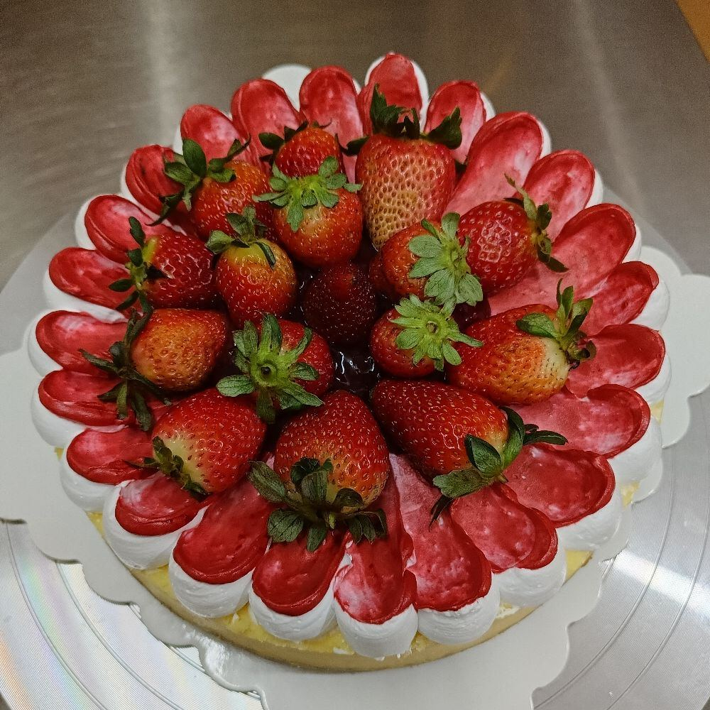
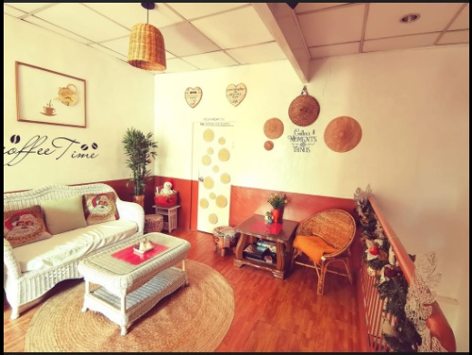
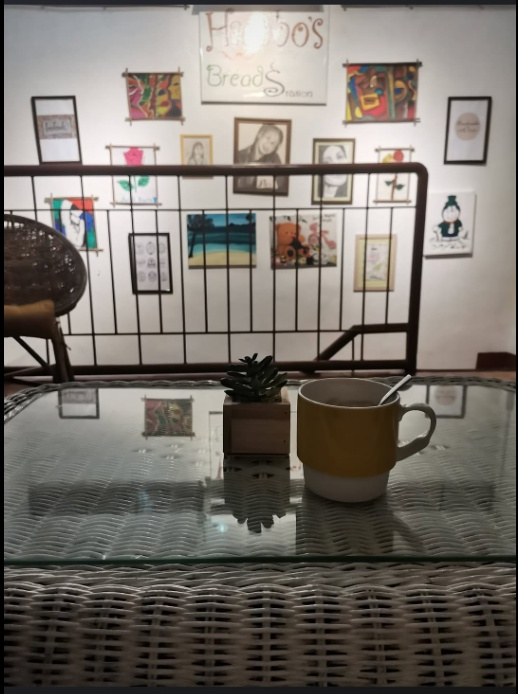
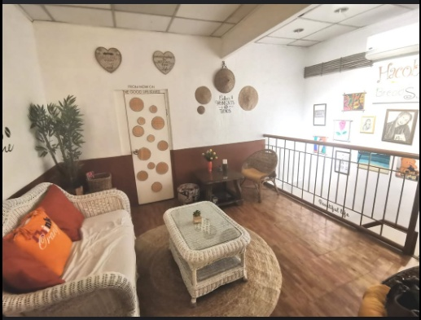
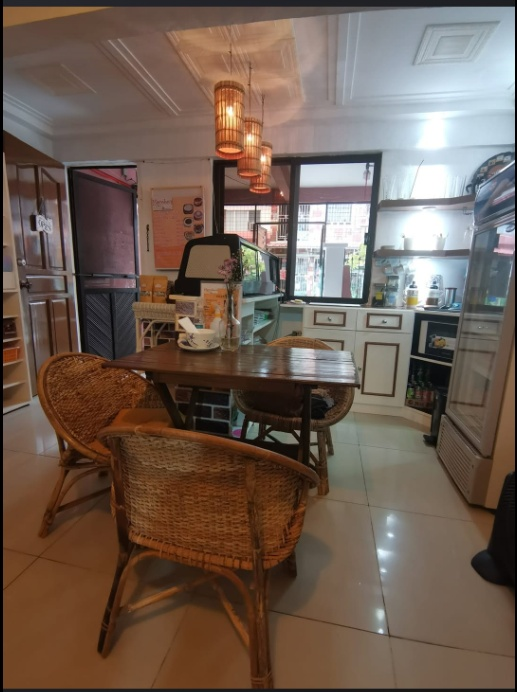

# ✅ HTML/CSS Updates Complete

## Summary of Changes

### 1. ✨ Navbar Brand - Pizza Emoji → Profile Image

**What changed:**

- Replaced the pizza emoji (🍕) with a professional profile image
- Changed navbar structure from `<h1>` with emoji to a clickable link with image

**HTML Changes:**

```html
<!-- BEFORE -->
<div class="navbar-brand">
  <h1>🍕 Hacobos Bread</h1>
</div>

<!-- AFTER -->
<a class="navbar-brand" href="#home">
  
  <span class="navbar-brand-text">Hacobos Bread</span>
</a>
```

**CSS Styling Added:**

- `.navbar-logo` - Circular image (50% border-radius) with 38px height
- `.navbar-brand` - Flex layout with image and text
- Hover effect (opacity change) for better UX
- Proper alignment and spacing

**Features:**
✓ Circular profile image (professional appearance)
✓ Clickable brand link (navigates to #home)
✓ Responsive sizing (fits navbar perfectly)
✓ Hover effect for interactivity
✓ Clean alignment with brand text

---

### 2. 🎠 About Section - Single Image → Bootstrap 5 Carousel

**What changed:**

- Replaced single placeholder image with interactive carousel
- Added Bootstrap 5 for carousel functionality
- Implemented 4-image carousel with previous/next controls

**HTML Changes:**

```html
<!-- BEFORE -->
<div class="about-image">
  
</div>

<!-- AFTER -->
<div class="about-image">
  <div id="aboutCarousel" class="carousel slide" data-bs-ride="carousel">
    <div class="carousel-inner">
      <div class="carousel-item active">
        
      </div>
      <div class="carousel-item">
        
      </div>
      <div class="carousel-item">
        
      </div>
      <div class="carousel-item">
        
      </div>
    </div>
    <button
      class="carousel-control-prev"
      type="button"
      data-bs-target="#aboutCarousel"
      data-bs-slide="prev"
    >
      <span class="carousel-control-prev-icon" aria-hidden="true"></span>
      <span class="visually-hidden">Previous</span>
    </button>
    <button
      class="carousel-control-next"
      type="button"
      data-bs-target="#aboutCarousel"
      data-bs-slide="next"
    >
      <span class="carousel-control-next-icon" aria-hidden="true"></span>
      <span class="visually-hidden">Next</span>
    </button>
  </div>
</div>
```

**Bootstrap 5 Integration:**

- Added Bootstrap 5 CSS in `<head>`
- Added Bootstrap 5 JS Bundle before closing `</body>` tag
- Uses Bootstrap carousel classes: `.carousel`, `.carousel-item`, `.carousel-control-prev/next`

**CSS Styling Added:**

- `#aboutCarousel` - Rounded corners and shadow
- `.carousel-inner` - Rounded corners
- `.carousel-item` - Minimum height (400px), flex centering
- `.carousel-item img` - Full-width, object-fit cover, rounded
- `.carousel-control-prev/next` - Styled semi-transparent buttons (44px circles)
- Hover effects on controls (darker on hover)

**Features:**
✓ 4-image carousel (Area1.jpg, Area2.jpg, Area3.jpg, Area4.jpg)
✓ Auto-play functionality (data-bs-ride="carousel")
✓ Previous/Next navigation buttons
✓ Smooth transitions between images
✓ Responsive and full-width
✓ Rounded corners and shadows for polish
✓ Accessible (alt text, ARIA labels)
✓ Professional appearance

---

## 📁 Files Modified

### 1. `index.html`

- Updated navbar brand structure (emoji → image)
- Converted About image to carousel
- Added Bootstrap 5 CSS link
- Added Bootstrap 5 JS Bundle script

### 2. `styles.css`

- Added `.navbar-brand` styles (flex layout)
- Added `.navbar-logo` styles (circular image)
- Added `.navbar-brand-text` styles
- Added complete carousel styling (`.carousel-*` classes)
- Maintained responsive design

---

## 🎨 Design Details

### Navbar Logo

- **Height**: 38px (fits navbar proportions)
- **Shape**: Circular (50% border-radius)
- **Object-fit**: Cover (maintains aspect ratio)
- **Spacing**: 0.8rem gap from text
- **Hover**: 0.8 opacity fade effect

### Carousel

- **Height**: 400px minimum
- **Border-radius**: 12px (matches existing design)
- **Shadow**: Uses `--shadow-lg` (professional depth)
- **Controls**: 44px circles, semi-transparent
- **Control Hover**: Darkens from rgba(0,0,0,0.3) to rgba(0,0,0,0.6)
- **Images**: Full-width, object-fit cover, rounded

---

## ✨ Key Features

### Navbar Brand Image

✓ Professional appearance with circular profile image
✓ Clickable link navigation to home
✓ Responsive sizing
✓ Hover interactivity
✓ Clean alignment with brand name

### Carousel Features

✓ **Auto-play**: Slides automatically (Bootstrap default)
✓ **Navigation**: Previous/Next arrow buttons
✓ **Responsive**: Full-width, adapts to container
✓ **Smooth transitions**: Bootstrap handles animations
✓ **Accessible**: Alt text, ARIA labels for screen readers
✓ **Professional styling**: Rounded corners, shadows, hover effects

---

## 🔧 How It Works

### Carousel Navigation

- Click **Previous (←)** button to go to previous image
- Click **Next (→)** button to go to next image
- Carousel auto-advances every 5 seconds (Bootstrap default)
- Images loop back after the last one

### Bootstrap Classes Used

- `.carousel` - Main container
- `.carousel-slide` - Adds slide animation
- `.carousel-inner` - Contains slides
- `.carousel-item` - Individual slide
- `.carousel-item.active` - Current active slide
- `.carousel-control-prev/next` - Navigation buttons
- `.d-block` - Display block (Bootstrap utility)
- `.w-100` - Width 100% (Bootstrap utility)
- `.visually-hidden` - Screen reader only (accessibility)

---

## 📱 Responsive Behavior

- **Desktop**: Full carousel with 400px height, rounded corners, smooth controls
- **Tablet**: Carousel adapts to container width, height maintained
- **Mobile**: Full-width carousel, touch-friendly navigation buttons

---

## ✅ Quality Checklist

- [x] Profile image replaces pizza emoji
- [x] Navbar brand is clickable
- [x] 4-image carousel implemented
- [x] Area1.jpg is the active/first image
- [x] Previous/Next controls present
- [x] Responsive design maintained
- [x] Bootstrap 5 properly integrated
- [x] CSS styled for consistency
- [x] Alt text added for accessibility
- [x] Professional appearance preserved

---

## 🚀 Ready to Deploy

Your website now features:

1. ✨ Professional profile image in navbar
2. 🎠 Interactive image carousel in About section
3. 🎨 Polished styling with rounded corners and shadows
4. ♿ Accessible with proper alt text and ARIA labels
5. 📱 Responsive on all device sizes

**All images should be placed in the `images/` folder:**

- `Profile.jpg` - Navbar brand image
- `Area1.jpg` - Carousel slide 1 (active)
- `Area2.jpg` - Carousel slide 2
- `Area3.jpg` - Carousel slide 3
- `Area4.jpg` - Carousel slide 4

The website is ready to use! 🎉
